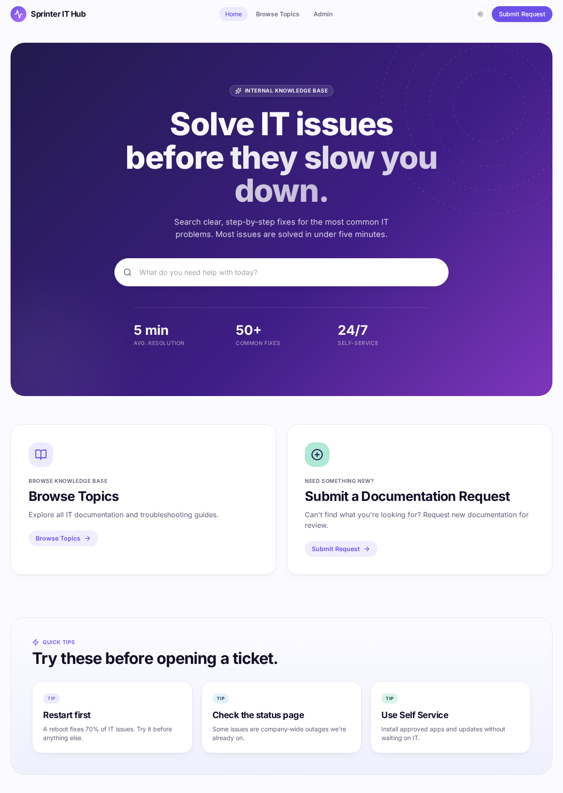
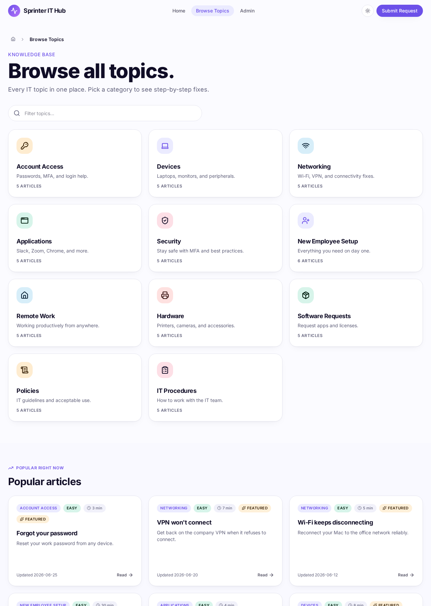
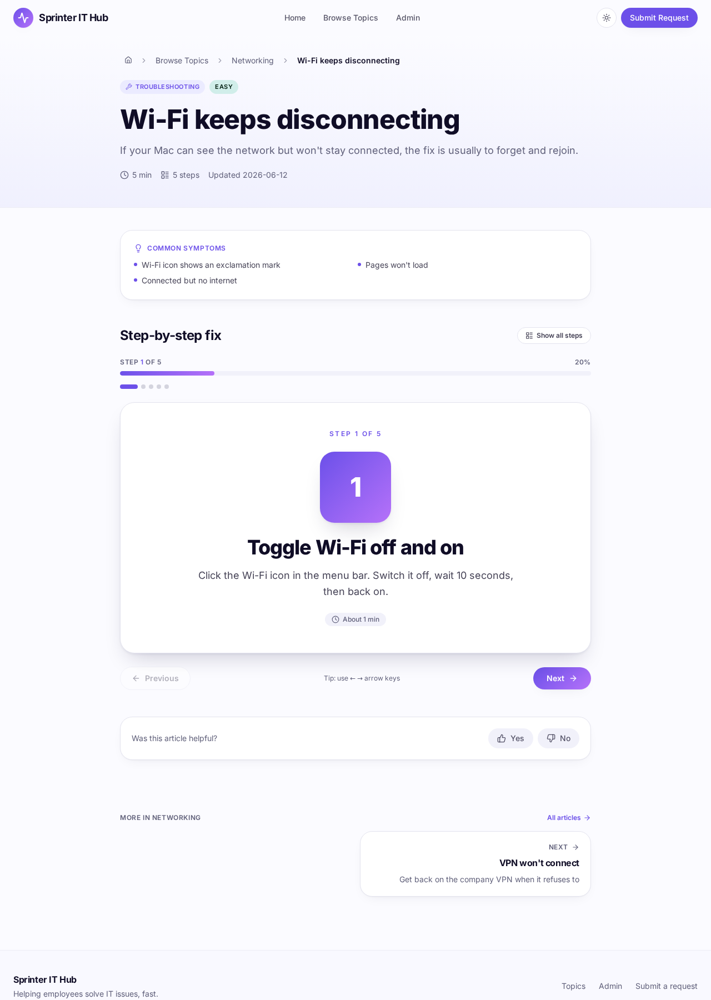
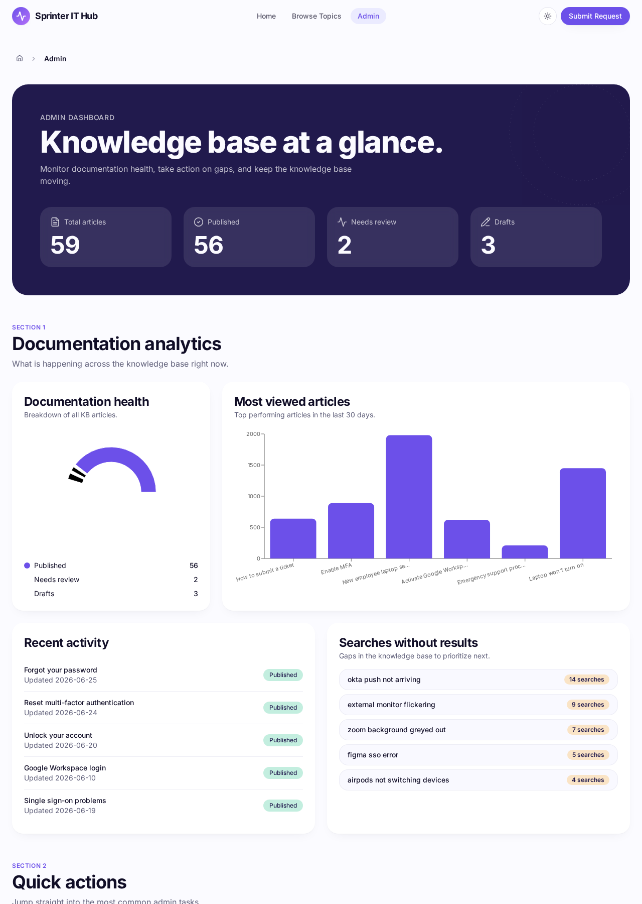

# Sprinter IT Hub

### Enterprise IT Knowledge Management Platform

Internal knowledge management platform designed to help organizations reduce repetitive IT support requests, improve employee self-service, standardize technical documentation, and streamline documentation workflows.

<p>
  
  
  
  
  
</p>

---

## Application Preview

> Screenshot placeholders will be replaced with actual images before repository publication.

### Homepage



### Browse Topics



### Interactive Article



### Admin Dashboard



---

## Live Demo

**Coming Soon**

> A production-ready deployment will be linked here once the project is published.

---

## Project Overview

Enterprise IT teams spend a significant portion of their time responding to the same repetitive questions: password resets, VPN issues, printer configuration, software access, and account setup. These requests are often simple to solve, but the knowledge required to solve them is scattered across chat threads, personal notes, or locked inside closed support tickets.

This creates several operational challenges:

- **Repeated IT support tickets** drain team capacity and slow response times for more critical issues.
- **Knowledge is trapped inside tickets** and never becomes reusable institutional knowledge.
- **Inconsistent documentation** leads to conflicting instructions and poor employee experiences.
- **Slow employee onboarding** increases the time it takes for new hires to become productive.
- **Lack of standardized documentation** makes it difficult to scale support across teams or locations.

**Sprinter IT Hub** addresses these challenges by giving employees a single, searchable place to find clear, step-by-step solutions to common IT problems. When an issue cannot be resolved through self-service, employees can submit a documentation request so the IT team can turn that gap into a published article for future use.

The result is a self-reinforcing knowledge base: every support interaction becomes an opportunity to improve documentation, reduce future tickets, and accelerate onboarding.

---

## Features

| Feature | Description |
| --- | --- |
| 🔍 Advanced Knowledge Search | Real-time search with suggestions, keyword highlighting, and instant article previews. |
| 📋 Interactive Troubleshooting Walkthroughs | Step-by-step article cards with progress tracking, difficulty indicators, and completion feedback. |
| 🗂️ Category-Based Knowledge Base | Browseable categories covering hardware, software, networking, security, onboarding, and more. |
| 📝 Documentation Request Workflow | Employees can request missing documentation, which IT can review and publish into the knowledge base. |
| 📊 Knowledge Analytics Dashboard | Operational insights including articles published, views, and knowledge base health. |
| 📱 Responsive Design | Fully optimized for desktop, tablet, and mobile devices. |
| 🌙 Light & Dark Mode | Theme-aware UI that respects user preference and reduces eye strain. |
| ♿ Accessibility-Focused Design | Semantic markup, keyboard navigation, focus states, and screen-reader friendly structure. |
| 🧩 Modern UI Components | Built with a polished component system for consistent, maintainable interfaces. |
| ✨ Microinteractions | Hover states, transitions, animations, and visual feedback that make the app feel alive. |
| 💡 Search Suggestions | Popular searches and recent queries surfaced directly from the search experience. |
| 📚 Documentation Governance | Concepts for review, approval, and publication workflows to ensure quality and consistency. |
| 🛠️ Admin Dashboard | Central hub for analytics, quick actions, workflow overview, and best practices. |

---

## Business Problems Solved

- ✅ Reduce repetitive IT support tickets
- ✅ Improve employee self-service
- ✅ Capture institutional knowledge
- ✅ Improve onboarding for new employees
- ✅ Standardize documentation across teams
- ✅ Increase documentation consistency
- ✅ Reduce support response times
- ✅ Improve documentation discoverability
- ✅ Support future automation initiatives

---

## How It Works

### Self-Service Resolution Path

```text
Employee
    ↓
Search Knowledge Base
    ↓
Find Relevant Article
    ↓
Follow Step-by-Step Guide
    ↓
Issue Resolved
    ↓
Support Ticket Avoided
```

### Documentation Request Path

```text
Employee
    ↓
Cannot Find Solution
    ↓
Submit Documentation Request
    ↓
IT Team Reviews Request
    ↓
Article Created & Approved
    ↓
Published to Knowledge Base
    ↓
Future Employees Benefit
```

---

## System Architecture

```text
Employee
    ↓
Sprinter IT Hub (Frontend)
    ↓
Documentation Repository
    ↓
Knowledge Workflow
    ↓
Published Articles
    ↓
Future Employees
```

The frontend provides a fast, searchable interface for employees. The documentation repository stores articles, categories, and metadata. The knowledge workflow governs how new documentation is requested, reviewed, approved, and published. Published articles then feed back into the knowledge base, making the system stronger over time.

---

## Technology Stack

| Technology | Purpose |
| --- | --- |
| React | UI library for building component-based interfaces |
| TypeScript | Type-safe development across the application |
| Vite | Fast build tooling and development server |
| Tailwind CSS | Utility-first styling and responsive design |
| TanStack Start / React Router | Full-stack React framework with file-based routing |
| shadcn/ui | Accessible, composable UI components |
| Radix UI | Headless primitives for dialogs, dropdowns, tooltips, and more |
| Lucide React | Clean, consistent iconography |
| React Hook Form | Form handling and validation |
| Zod | Schema validation for type-safe inputs |
| Recharts | Data visualization for analytics dashboards |
| Sonner | Toast notifications and user feedback |

---

## Operational Workflow (Concept)

This prototype demonstrates how documentation could be managed within an organization using a lightweight operational workflow. The following represents the **intended architecture** rather than the current implementation.

### Lightweight Documentation Pipeline

| Stage | Tool | Purpose |
| --- | --- | --- |
| Capture | Google Sheets | A lightweight documentation repository for drafting articles, tracking requests, and organizing categories. |
| Review | Make.com | Automation workflows that route documentation requests through review and approval before publication. |
| Publish | Supabase (future) | Migration to an enterprise backend for scalable storage, auth, roles, and analytics. |

### Concept Flow

```text
Support Request Received
    ↓
Gap Identified in Knowledge Base
    ↓
Documentation Request Submitted
    ↓
Draft Created in Repository
    ↓
Review & Approval Workflow
    ↓
Article Published
    ↓
Available to All Employees
```

This approach demonstrates how documentation can move from ad-hoc support requests through a structured review and approval process before becoming published knowledge. It highlights the operational thinking behind the platform: turning support friction into reusable, scalable documentation.

---

## Design Goals

Sprinter IT Hub was intentionally designed around five core principles:

1. **Reduce repetitive IT support requests** — Make the most common issues solvable without opening a ticket.
2. **Improve employee self-service** — Give employees a fast, intuitive way to find answers on their own.
3. **Make documentation easier to discover** — Search, categories, and suggestions surface the right content at the right time.
4. **Standardize knowledge management** — Consistent formatting, step-by-step instructions, and metadata ensure quality across articles.
5. **Build a scalable foundation for future automation** — A clean architecture and component system ready for backend integration, AI search, and workflow automation.

---

## Application Structure

```text
src/
├── components/        # Reusable UI components and page sections
├── routes/            # TanStack Start file-based routes
├── hooks/             # Custom React hooks for theme, animations, etc.
├── data/              # Mock knowledge base content and categories
├── styles/            # Global styles and theme tokens
├── assets/            # Static image and icon assets
├── public/            # Public-facing files including favicon
```

---

## Future Roadmap

| Initiative | Description |
| --- | --- |
| AI Knowledge Search | Natural language search that understands intent and suggests precise articles. |
| AI Documentation Assistant | Help IT teams draft, review, and improve articles automatically. |
| Version History | Track changes to articles and allow rollback to previous versions. |
| Role-Based Permissions | Separate permissions for employees, authors, reviewers, and admins. |
| Knowledge Analytics | Deeper insights into search behavior, deflection rates, and content gaps. |
| Slack Integration | Search and request documentation directly from Slack. |
| Microsoft Teams Integration | Surface knowledge base articles inside Teams conversations. |
| Google Workspace Integration | Seamless access for organizations using Google Workspace. |
| ServiceNow Integration | Sync tickets and deflection data with ServiceNow. |
| Zendesk Integration | Connect helpdesk workflows to knowledge base analytics. |
| Automated Documentation Reviews | Periodic prompts to review, update, or retire outdated articles. |

---

## Why I Built This

This project was created to demonstrate how thoughtful documentation management, employee self-service, workflow automation concepts, and knowledge governance can improve internal IT operations.

The goal was not just to build a searchable knowledge base, but to design a platform that feels like a real enterprise SaaS product. Every interaction, animation, and workflow decision was made to communicate trust, clarity, and operational efficiency.

Sprinter IT Hub shows how product design and operational thinking can turn everyday support friction into a scalable, self-improving system.

---

## About

**Tierra Barrow**

Software Engineer • Continuous Learner

[GitHub: @tcodes27](https://github.com/tcodes27)
